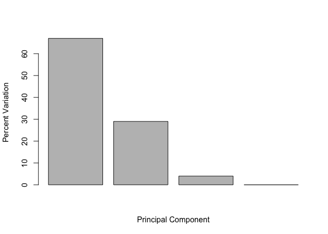

## K-means clustering example 

Let's make up some data for testing the `kmeans()` function.


```r
tmp <- c(rnorm(30,-3), rnorm(30,3))
x <- cbind(x=tmp, y=rev(tmp))
plot(x)
```

<!-- -->

Use the kmeans() function setting k to 2 and nstart=20
Inspect/print the results
Q. How many points are in each cluster?
Q. What ‘component’ of your result object details
    - cluster size?
    - cluster assignment/membership?
    - cluster center?
    

```r
#km$cluster
```
    
    

```r
#km$centers
```
    
Plot x colored by the kmeans cluster assignment and
      add cluster centers as blue points
      

```r
#plot(x, col = km$cluster, pch = 16)
#points(km$centers, col = "blue", pch = 15)
```
      
Q. Repeat for k=3, which one has the better total SS?


```r
km <- kmeans(x, centers = 2, nstart = 20)
km
```

```
## K-means clustering with 2 clusters of sizes 30, 30
## 
## Cluster means:
##           x         y
## 1 -2.827615  2.991311
## 2  2.991311 -2.827615
## 
## Clustering vector:
##  [1] 1 1 1 1 1 1 1 1 1 1 1 1 1 1 1 1 1 1 1 1 1 1 1 1 1 1 1 1 1 1 2 2 2 2 2
## [36] 2 2 2 2 2 2 2 2 2 2 2 2 2 2 2 2 2 2 2 2 2 2 2 2 2
## 
## Within cluster sum of squares by cluster:
## [1] 51.5995 51.5995
##  (between_SS / total_SS =  90.8 %)
## 
## Available components:
## 
## [1] "cluster"      "centers"      "totss"        "withinss"    
## [5] "tot.withinss" "betweenss"    "size"         "iter"        
## [9] "ifault"
```

#Hierarchical clustering


First we need to calculate point (dis)similarity as the Euclidean distance between observations


```r
dist_matrix <- dist(x)
```


```r
class(dist_matrix)
```

```
## [1] "dist"
```

Convert to matrix to see the structure of the distance matrix and find the dimensions (to view...View(as.matrix(dist_matrix)) )


```r
dim(as.matrix(dist_matrix))
```

```
## [1] 60 60
```

The hclust() function returns a hierarchical clustering model


```r
hc <- hclust(d = dist_matrix)
```


```r
hc
```

```
## 
## Call:
## hclust(d = dist_matrix)
## 
## Cluster method   : complete 
## Distance         : euclidean 
## Number of objects: 60
```


```r
class(hc)
```

```
## [1] "hclust"
```


```r
plot(hc)
abline(h = 6, col = "tomato")
```

<!-- -->

Let's 'cut' our tree to define our clusters


```r
grps <- cutree(hc, h = 6)
table(grps)
```

```
## grps
##  1  2 
## 30 30
```


```r
plot(x, col = grps)
```

<!-- -->

Try different cutting


```r
plot(x, col = cutree(hc, k = 4))
```

<!-- -->


Try it out

# Step 1. Generate some example data for clustering


```r
x <- rbind(
  matrix(rnorm(100, mean=0, sd = 0.3), ncol = 2),   # c1
  matrix(rnorm(100, mean = 1, sd = 0.3), ncol = 2), # c2
  matrix(c(rnorm(50, mean = 1, sd = 0.3),           # c3
           rnorm(50, mean = 0, sd = 0.3)), ncol = 2))
colnames(x) <- c("x", "y")
```


Step 2. Plot the data without clustering


```r
plot(x)
```

<!-- -->


Step 3. Generate colors for known clusters
        (just so we can compare to hclust results)


```r
col <- as.factor( rep(c("c1","c2","c3"), each = 50) )
plot(x, col = col)
```

<!-- -->


Q. Use the dist(), hclust(), plot() and cutree() functions to return 2 and 3 clusters


```r
d <- dist(x)
hc <- hclust(d)
plot(hc)
```

<!-- -->

Let's cut into 2 groups


```r
grps <- cutree(hc, k = 3)
table(grps)
```

```
## grps
##  1  2  3 
## 58 64 28
```

Plot the data colored by cluster

```r
plot(x, col = grps)
```

<!-- -->


```r
plot(x, col = cutree(hc, k = 2))
```

<!-- -->

```r
plot(x, col = cutree(hc, k = 3))
```

<!-- -->


# Q. How does this compare to your known 'col' groups?


# Principal Component Analysis


```r
mydata <- read.csv("https://tinyurl.com/expression-CSV", row.names = 1)


head(mydata)
```

```
##        wt1 wt2  wt3  wt4 wt5 ko1 ko2 ko3 ko4 ko5
## gene1  439 458  408  429 420  90  88  86  90  93
## gene2  219 200  204  210 187 427 423 434 433 426
## gene3 1006 989 1030 1017 973 252 237 238 226 210
## gene4  783 792  829  856 760 849 856 835 885 894
## gene5  181 249  204  244 225 277 305 272 270 279
## gene6  460 502  491  491 493 612 594 577 618 638
```


```r
#View(t(mydata))
```


```r
pca <- prcomp(t(mydata), scale = TRUE)

attributes(pca)
```

```
## $names
## [1] "sdev"     "rotation" "center"   "scale"    "x"       
## 
## $class
## [1] "prcomp"
```


```r
plot(pca$x[,1], pca$x[,2]) 
```

<!-- -->

## Percent variance captured per PC

```r
pca.var <- pca$sdev^2
pca.var.per <- round(pca.var/sum(pca.var)*100, 1)
pca.var.per
```

```
##  [1] 92.6  2.3  1.1  1.1  0.8  0.7  0.6  0.4  0.4  0.0
```


```r
barplot(pca.var.per, main = "Scree Plot",
 xlab = "Principal Component", ylab = "Percent Variation")
```

<!-- -->


```r
## A vector of colors for wt and ko samples
colvec <- as.factor( substr( colnames(mydata), 1, 2) )
plot(pca$x[,1], pca$x[,2], col = colvec, pch = 16,
 xlab = paste0("PC1 (", pca.var.per[1], "%)"),
 ylab = paste0("PC2 (", pca.var.per[2], "%)"))
```

<!-- -->


```r
mycols <- as.factor(substr(colnames(mydata), 1, 2))
plot(pca$x[,1], pca$x[,2], col = mycols, pch = 16,
     xlab = paste0("PC1 (",pca.var.per[1]," %)"), 
     ylab = paste0("PC2 (",pca.var.per[2]," %)"))

text(pca$x[,1] + 0.75, pca$x[,2], colnames(mydata))
```

<!-- -->


#PCA of UK food data


```r
#par(mar=c(20, 4, 4, 2))
x <- read.csv("UK_foods.csv")
rownames(x) <- x[,1]
x <- x[,-1]
head(x)
```

```
##                England Wales Scotland N.Ireland
## Cheese             105   103      103        66
## Carcass_meat       245   227      242       267
## Other_meat         685   803      750       586
## Fish               147   160      122        93
## Fats_and_oils      193   235      184       209
## Sugars             156   175      147       139
```

```r
dim(x)
```

```
## [1] 17  4
```

```r
heatmap(as.matrix(x))
```

<!-- -->


```r
pca <- prcomp( t(x) )
summary(pca)
```

```
## Importance of components:
##                             PC1      PC2      PC3       PC4
## Standard deviation     324.1502 212.7478 73.87622 4.189e-14
## Proportion of Variance   0.6744   0.2905  0.03503 0.000e+00
## Cumulative Proportion    0.6744   0.9650  1.00000 1.000e+00
```


```r
plot(pca$x[,1], pca$x[,2], xlab="PC1", ylab="PC2", xlim=c(-270,500))
text(pca$x[,1], pca$x[,2], colnames(x))
```

<!-- -->


```r
v <- round( pca$sdev^2/sum(pca$sdev^2) * 100 )
v
```

```
## [1] 67 29  4  0
```


```r
z <- summary(pca)
z$importance
```

```
##                              PC1       PC2      PC3          PC4
## Standard deviation     324.15019 212.74780 73.87622 4.188568e-14
## Proportion of Variance   0.67444   0.29052  0.03503 0.000000e+00
## Cumulative Proportion    0.67444   0.96497  1.00000 1.000000e+00
```


```r
barplot(v, xlab="Principal Component", ylab="Percent Variation")
```

<!-- -->


```r
cumsum(v)
```

```
## [1]  67  96 100 100
```


