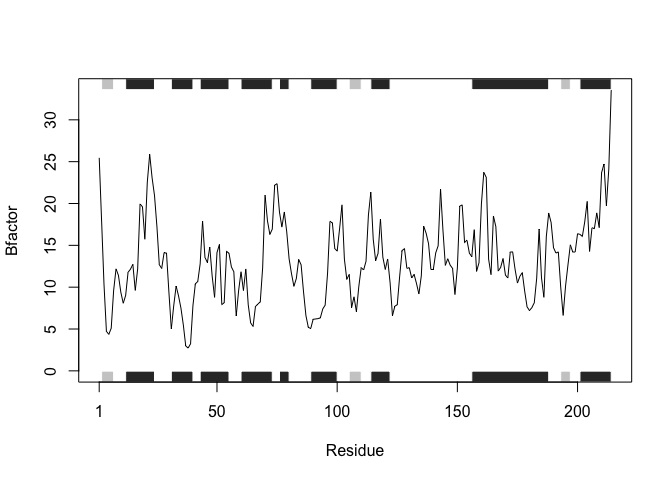
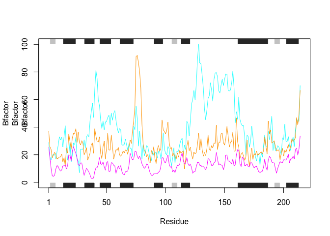
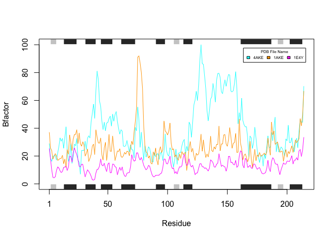

#Given Code

```r
# Can you improve this analysis code?
library(bio3d)
s1 <- read.pdb("4AKE") # kinase with drug
```

```
##   Note: Accessing on-line PDB file
```

```r
s2 <- read.pdb("1AKE") # kinase no drug
```

```
##   Note: Accessing on-line PDB file
##    PDB has ALT records, taking A only, rm.alt=TRUE
```

```r
s3 <- read.pdb("1E4Y") # kinase with drug
```

```
##   Note: Accessing on-line PDB file
```

```r
s1.chainA <- trim.pdb(s1, chain = "A", elety = "CA")
s2.chainA <- trim.pdb(s2, chain = "A", elety = "CA")
s3.chainA <- trim.pdb(s3, chain = "A", elety = "CA")

s1.b <- s1.chainA$atom$b
s2.b <- s2.chainA$atom$b
s3.b <- s3.chainA$atom$b

plotb3(s1.b, sse = s1.chainA, typ = "l", ylab = "Bfactor")
```

<!-- -->

```r
plotb3(s2.b, sse = s2.chainA, typ = "l", ylab = "Bfactor")
```

<!-- -->

```r
plotb3(s3.b, sse = s3.chainA, typ = "l", ylab = "Bfactor")
```

<!-- -->

## Q6:How would you generalize the original code above to work with any set of input protein structures?

# What lines of code get repeated for each?


```r
s1 <- read.pdb("4AKE") # kinase with drug
```

```
##   Note: Accessing on-line PDB file
```

```
## Warning in get.pdb(file, path = tempdir(), verbose = FALSE): /var/folders/
## fr/kx9dm6l16qz51brxwd8t77b80000gn/T//RtmpYnjNWZ/4AKE.pdb exists. Skipping
## download
```

```r
s1.chainA <- trim.pdb(s1, chain = "A", elety = "CA")

s1.b <- s1.chainA$atom$b
s1.chainA$atom
```

```
##      type eleno elety  alt resid chain resno insert       x       y
## 2    ATOM     2    CA <NA>   MET     A     1   <NA>  -9.901 -24.422
## 10   ATOM    10    CA <NA>   ARG     A     2   <NA>  -7.028 -22.352
## 21   ATOM    21    CA <NA>   ILE     A     3   <NA>  -5.227 -20.106
## 29   ATOM    29    CA <NA>   ILE     A     4   <NA>  -2.477 -17.496
## 37   ATOM    37    CA <NA>   LEU     A     5   <NA>  -2.565 -14.983
## 45   ATOM    45    CA <NA>   LEU     A     6   <NA>   0.768 -13.265
## 53   ATOM    53    CA <NA>   GLY     A     7   <NA>   1.394 -10.431
## 57   ATOM    57    CA <NA>   ALA     A     8   <NA>   3.395  -7.286
## 62   ATOM    62    CA <NA>   PRO     A     9   <NA>   1.751  -3.951
## 69   ATOM    69    CA <NA>   GLY     A    10   <NA>   0.015  -2.928
## 73   ATOM    73    CA <NA>   ALA     A    11   <NA>  -0.245  -6.408
## 78   ATOM    78    CA <NA>   GLY     A    12   <NA>  -3.997  -6.640
## 82   ATOM    82    CA <NA>   LYS     A    13   <NA>  -4.260  -9.988
## 91   ATOM    91    CA <NA>   GLY     A    14   <NA>  -7.477  -8.701
## 95   ATOM    95    CA <NA>   THR     A    15   <NA>  -9.115  -9.225
## 102  ATOM   102    CA <NA>   GLN     A    16   <NA>  -9.497 -12.931
## 111  ATOM   111    CA <NA>   ALA     A    17   <NA> -10.578 -12.687
## 116  ATOM   116    CA <NA>   GLN     A    18   <NA> -14.357 -12.543
## 125  ATOM   125    CA <NA>   PHE     A    19   <NA> -14.086 -15.630
## 136  ATOM   136    CA <NA>   ILE     A    20   <NA> -12.235 -17.560
## 144  ATOM   144    CA <NA>   MET     A    21   <NA> -14.712 -16.590
## 152  ATOM   152    CA <NA>   GLU     A    22   <NA> -17.629 -17.379
## 161  ATOM   161    CA <NA>   LYS     A    23   <NA> -16.228 -20.729
## 170  ATOM   170    CA <NA>   TYR     A    24   <NA> -15.265 -22.028
## 182  ATOM   182    CA <NA>   GLY     A    25   <NA> -17.460 -20.048
## 186  ATOM   186    CA <NA>   ILE     A    26   <NA> -14.555 -18.595
## 194  ATOM   194    CA <NA>   PRO     A    27   <NA> -13.805 -15.020
## 201  ATOM   201    CA <NA>   GLN     A    28   <NA> -10.906 -12.712
## 210  ATOM   210    CA <NA>   ILE     A    29   <NA>  -8.804 -11.920
## 218  ATOM   218    CA <NA>   SER     A    30   <NA>  -6.192  -9.217
## 224  ATOM   224    CA <NA>   THR     A    31   <NA>  -4.144  -8.071
## 231  ATOM   231    CA <NA>   GLY     A    32   <NA>  -5.246  -4.466
## 235  ATOM   235    CA <NA>   ASP     A    33   <NA>  -8.898  -5.497
## 243  ATOM   243    CA <NA>   MET     A    34   <NA>  -8.292  -7.982
## 251  ATOM   251    CA <NA>   LEU     A    35   <NA>  -6.401  -5.481
## 259  ATOM   259    CA <NA>   ARG     A    36   <NA>  -9.098  -2.856
## 270  ATOM   270    CA <NA>   ALA     A    37   <NA> -11.616  -5.549
## 275  ATOM   275    CA <NA>   ALA     A    38   <NA>  -9.824  -6.758
## 280  ATOM   280    CA <NA>   VAL     A    39   <NA>  -9.687  -3.275
## 287  ATOM   287    CA <NA>   LYS     A    40   <NA> -13.424  -2.667
## 296  ATOM   296    CA <NA>   SER     A    41   <NA> -14.424  -5.983
## 302  ATOM   302    CA <NA>   GLY     A    42   <NA> -12.442  -5.274
## 306  ATOM   306    CA <NA>   SER     A    43   <NA> -11.066  -8.743
## 312  ATOM   312    CA <NA>   GLU     A    44   <NA>  -7.796  -9.348
## 321  ATOM   321    CA <NA>   LEU     A    45   <NA>  -5.639  -9.232
## 329  ATOM   329    CA <NA>   GLY     A    46   <NA>  -7.720  -6.400
## 333  ATOM   333    CA <NA>   LYS     A    47   <NA>  -7.018  -4.236
## 342  ATOM   342    CA <NA>   GLN     A    48   <NA>  -3.304  -5.133
## 351  ATOM   351    CA <NA>   ALA     A    49   <NA>  -3.366  -4.114
## 356  ATOM   356    CA <NA>   LYS     A    50   <NA>  -5.455  -0.962
## 365  ATOM   365    CA <NA>   ASP     A    51   <NA>  -2.842   0.502
## 373  ATOM   373    CA <NA>   ILE     A    52   <NA>   0.045  -0.309
## 381  ATOM   381    CA <NA>   MET     A    53   <NA>  -1.643   1.374
## 389  ATOM   389    CA <NA>   ASP     A    54   <NA>  -2.778   4.300
## 397  ATOM   397    CA <NA>   ALA     A    55   <NA>   0.787   4.770
## 402  ATOM   402    CA <NA>   GLY     A    56   <NA>   1.935   4.782
## 406  ATOM   406    CA <NA>   LYS     A    57   <NA>   3.856   1.578
## 415  ATOM   415    CA <NA>   LEU     A    58   <NA>   4.156  -1.240
## 423  ATOM   423    CA <NA>   VAL     A    59   <NA>   2.365  -4.528
## 430  ATOM   430    CA <NA>   THR     A    60   <NA>   4.734  -7.387
## 437  ATOM   437    CA <NA>   ASP     A    61   <NA>   4.606 -10.636
## 445  ATOM   445    CA <NA>   GLU     A    62   <NA>   3.685 -12.298
## 454  ATOM   454    CA <NA>   LEU     A    63   <NA>   0.529 -10.257
## 462  ATOM   462    CA <NA>   VAL     A    64   <NA>  -0.278 -10.586
## 469  ATOM   469    CA <NA>   ILE     A    65   <NA>  -0.115 -14.401
## 477  ATOM   477    CA <NA>   ALA     A    66   <NA>  -2.297 -14.315
## 482  ATOM   482    CA <NA>   LEU     A    67   <NA>  -4.978 -12.266
## 490  ATOM   490    CA <NA>   VAL     A    68   <NA>  -4.880 -14.670
## 497  ATOM   497    CA <NA>   LYS     A    69   <NA>  -5.342 -17.671
## 506  ATOM   506    CA <NA>   GLU     A    70   <NA>  -8.182 -15.890
## 515  ATOM   515    CA <NA>   ARG     A    71   <NA>  -9.735 -14.749
## 526  ATOM   526    CA <NA>   ILE     A    72   <NA>  -9.664 -18.002
## 534  ATOM   534    CA <NA>   ALA     A    73   <NA> -11.326 -19.542
## 539  ATOM   539    CA <NA>   GLN     A    74   <NA> -14.475 -17.584
## 548  ATOM   548    CA <NA>   GLU     A    75   <NA> -17.200 -19.754
## 557  ATOM   557    CA <NA>   ASP     A    76   <NA> -17.185 -17.880
## 565  ATOM   565    CA <NA>   CYS     A    77   <NA> -13.764 -19.497
## 571  ATOM   571    CA <NA>   ARG     A    78   <NA> -15.293 -22.933
## 582  ATOM   582    CA <NA>   ASN     A    79   <NA> -14.722 -23.611
## 590  ATOM   590    CA <NA>   GLY     A    80   <NA> -11.233 -22.180
## 594  ATOM   594    CA <NA>   PHE     A    81   <NA> -10.086 -18.686
## 605  ATOM   605    CA <NA>   LEU     A    82   <NA>  -8.252 -16.401
## 613  ATOM   613    CA <NA>   LEU     A    83   <NA>  -5.348 -14.700
## 621  ATOM   621    CA <NA>   ASP     A    84   <NA>  -4.443 -11.758
## 629  ATOM   629    CA <NA>   GLY     A    85   <NA>  -0.781 -10.634
## 633  ATOM   633    CA <NA>   PHE     A    86   <NA>   0.255 -12.328
## 644  ATOM   644    CA <NA>   PRO     A    87   <NA>   2.733 -13.731
## 651  ATOM   651    CA <NA>   ARG     A    88   <NA>   5.248 -11.143
## 662  ATOM   662    CA <NA>   THR     A    89   <NA>   8.423 -12.849
## 669  ATOM   669    CA <NA>   ILE     A    90   <NA>   9.848 -16.353
## 677  ATOM   677    CA <NA>   PRO     A    91   <NA>   9.733 -15.505
## 684  ATOM   684    CA <NA>   GLN     A    92   <NA>   5.989 -14.839
## 693  ATOM   693    CA <NA>   ALA     A    93   <NA>   5.415 -17.915
## 698  ATOM   698    CA <NA>   ASP     A    94   <NA>   7.335 -20.175
## 706  ATOM   706    CA <NA>   ALA     A    95   <NA>   5.301 -18.979
## 711  ATOM   711    CA <NA>   MET     A    96   <NA>   2.051 -19.767
## 719  ATOM   719    CA <NA>   LYS     A    97   <NA>   3.301 -23.289
## 728  ATOM   728    CA <NA>   GLU     A    98   <NA>   4.337 -23.551
## 737  ATOM   737    CA <NA>   ALA     A    99   <NA>   0.921 -22.393
## 742  ATOM   742    CA <NA>   GLY     A   100   <NA>  -0.621 -25.227
## 746  ATOM   746    CA <NA>   ILE     A   101   <NA>  -2.019 -22.965
## 754  ATOM   754    CA <NA>   ASN     A   102   <NA>  -1.521 -24.964
## 762  ATOM   762    CA <NA>   VAL     A   103   <NA>  -2.549 -23.751
## 769  ATOM   769    CA <NA>   ASP     A   104   <NA>  -3.511 -25.770
## 777  ATOM   777    CA <NA>   TYR     A   105   <NA>  -2.364 -23.232
## 789  ATOM   789    CA <NA>   VAL     A   106   <NA>   0.038 -20.419
## 796  ATOM   796    CA <NA>   LEU     A   107   <NA>  -0.631 -18.614
## 804  ATOM   804    CA <NA>   GLU     A   108   <NA>   1.720 -16.011
## 813  ATOM   813    CA <NA>   PHE     A   109   <NA>  -0.008 -13.621
## 824  ATOM   824    CA <NA>   ASP     A   110   <NA>   2.733 -12.724
## 832  ATOM   832    CA <NA>   VAL     A   111   <NA>   2.887  -9.442
## 839  ATOM   839    CA <NA>   PRO     A   112   <NA>   6.278  -8.108
## 846  ATOM   846    CA <NA>   ASP     A   113   <NA>   7.570  -5.021
## 854  ATOM   854    CA <NA>   GLU     A   114   <NA>   7.702  -3.047
## 863  ATOM   863    CA <NA>   LEU     A   115   <NA>   4.102  -3.807
## 871  ATOM   871    CA <NA>   ILE     A   116   <NA>   3.103  -2.760
## 879  ATOM   879    CA <NA>   VAL     A   117   <NA>   5.245   0.415
## 886  ATOM   886    CA <NA>   ASP     A   118   <NA>   3.433   1.204
## 894  ATOM   894    CA <NA>   ARG     A   119   <NA>   0.045   0.469
## 905  ATOM   905    CA <NA>   ILE     A   120   <NA>   0.711   3.053
## 913  ATOM   913    CA <NA>   VAL     A   121   <NA>   3.078   5.887
## 920  ATOM   920    CA <NA>   GLY     A   122   <NA>   0.963   6.738
## 924  ATOM   924    CA <NA>   ARG     A   123   <NA>  -2.167   7.692
## 935  ATOM   935    CA <NA>   ARG     A   124   <NA>  -3.720  11.125
## 946  ATOM   946    CA <NA>   VAL     A   125   <NA>  -6.439  11.778
## 953  ATOM   953    CA <NA>   HIS     A   126   <NA>  -9.028  14.474
## 963  ATOM   963    CA <NA>   ALA     A   127   <NA>  -8.159  15.378
## 968  ATOM   968    CA <NA>   PRO     A   128   <NA> -11.571  16.743
## 975  ATOM   975    CA <NA>   SER     A   129   <NA> -13.695  13.757
## 981  ATOM   981    CA <NA>   GLY     A   130   <NA> -11.241  10.889
## 985  ATOM   985    CA <NA>   ARG     A   131   <NA> -11.770  10.135
## 996  ATOM   996    CA <NA>   VAL     A   132   <NA>  -8.814   8.251
## 1003 ATOM  1003    CA <NA>   TYR     A   133   <NA>  -7.447   8.105
## 1015 ATOM  1015    CA <NA>   HIS     A   134   <NA>  -4.543   6.390
## 1025 ATOM  1025    CA <NA>   VAL     A   135   <NA>  -2.851   8.189
## 1032 ATOM  1032    CA <NA>   LYS     A   136   <NA>  -2.947   4.882
## 1041 ATOM  1041    CA <NA>   PHE     A   137   <NA>  -5.691   2.739
## 1052 ATOM  1052    CA <NA>   ASN     A   138   <NA>  -8.460   5.283
## 1060 ATOM  1060    CA <NA>   PRO     A   139   <NA>  -7.389   8.735
## 1067 ATOM  1067    CA <NA>   PRO     A   140   <NA>  -9.686  11.650
## 1074 ATOM  1074    CA <NA>   LYS     A   141   <NA> -11.703  12.964
## 1083 ATOM  1083    CA <NA>   VAL     A   142   <NA>  -9.854  16.249
## 1090 ATOM  1090    CA <NA>   GLU     A   143   <NA>  -6.442  14.821
## 1099 ATOM  1099    CA <NA>   GLY     A   144   <NA>  -5.069  16.360
## 1103 ATOM  1103    CA <NA>   LYS     A   145   <NA>  -8.567  17.580
## 1112 ATOM  1112    CA <NA>   ASP     A   146   <NA> -11.239  15.970
## 1120 ATOM  1120    CA <NA>   ASP     A   147   <NA> -14.240  15.020
## 1128 ATOM  1128    CA <NA>   VAL     A   148   <NA> -16.894  15.968
## 1135 ATOM  1135    CA <NA>   THR     A   149   <NA> -15.623  19.374
## 1142 ATOM  1142    CA <NA>   GLY     A   150   <NA> -13.222  20.470
## 1146 ATOM  1146    CA <NA>   GLU     A   151   <NA> -10.771  20.738
## 1155 ATOM  1155    CA <NA>   GLU     A   152   <NA>  -7.096  19.788
## 1164 ATOM  1164    CA <NA>   LEU     A   153   <NA>  -5.950  16.369
## 1172 ATOM  1172    CA <NA>   THR     A   154   <NA>  -2.938  15.471
## 1179 ATOM  1179    CA <NA>   THR     A   155   <NA>  -0.653  12.593
## 1186 ATOM  1186    CA <NA>   ARG     A   156   <NA>  -0.733  11.036
## 1197 ATOM  1197    CA <NA>   LYS     A   157   <NA>   2.560  11.095
## 1206 ATOM  1206    CA <NA>   ASP     A   158   <NA>   2.384   7.312
## 1214 ATOM  1214    CA <NA>   ASP     A   159   <NA>   2.061   7.029
## 1222 ATOM  1222    CA <NA>   GLN     A   160   <NA>   5.498   8.640
## 1231 ATOM  1231    CA <NA>   GLU     A   161   <NA>   7.901   6.382
## 1240 ATOM  1240    CA <NA>   GLU     A   162   <NA>  10.659   6.758
## 1249 ATOM  1249    CA <NA>   THR     A   163   <NA>   8.260   5.844
## 1256 ATOM  1256    CA <NA>   VAL     A   164   <NA>   6.785   2.908
## 1263 ATOM  1263    CA <NA>   ARG     A   165   <NA>  10.107   1.349
## 1274 ATOM  1274    CA <NA>   LYS     A   166   <NA>  11.286   1.660
## 1283 ATOM  1283    CA <NA>   ARG     A   167   <NA>   8.203  -0.073
## 1294 ATOM  1294    CA <NA>   LEU     A   168   <NA>   8.761  -2.980
## 1302 ATOM  1302    CA <NA>   VAL     A   169   <NA>  12.440  -3.514
## 1309 ATOM  1309    CA <NA>   GLU     A   170   <NA>  11.557  -3.317
## 1318 ATOM  1318    CA <NA>   TYR     A   171   <NA>   8.844  -5.924
## 1330 ATOM  1330    CA <NA>   HIS     A   172   <NA>  11.163  -8.267
## 1340 ATOM  1340    CA <NA>   GLN     A   173   <NA>  14.107  -8.297
## 1349 ATOM  1349    CA <NA>   MET     A   174   <NA>  11.551  -9.104
## 1357 ATOM  1357    CA <NA>   THR     A   175   <NA>   9.443 -11.711
## 1364 ATOM  1364    CA <NA>   ALA     A   176   <NA>  12.084 -13.570
## 1369 ATOM  1369    CA <NA>   PRO     A   177   <NA>  13.053 -15.945
## 1376 ATOM  1376    CA <NA>   LEU     A   178   <NA>   9.391 -16.417
## 1384 ATOM  1384    CA <NA>   ILE     A   179   <NA>   8.528 -17.683
## 1392 ATOM  1392    CA <NA>   GLY     A   180   <NA>  11.552 -19.954
## 1396 ATOM  1396    CA <NA>   TYR     A   181   <NA>  10.377 -21.026
## 1408 ATOM  1408    CA <NA>   TYR     A   182   <NA>   6.949 -21.944
## 1420 ATOM  1420    CA <NA>   SER     A   183   <NA>   8.422 -23.921
## 1426 ATOM  1426    CA <NA>   LYS     A   184   <NA>  10.539 -26.020
## 1435 ATOM  1435    CA <NA>   GLU     A   185   <NA>   7.403 -26.586
## 1444 ATOM  1444    CA <NA>   ALA     A   186   <NA>   5.477 -27.492
## 1449 ATOM  1449    CA <NA>   GLU     A   187   <NA>   8.198 -30.014
## 1458 ATOM  1458    CA <NA>   ALA     A   188   <NA>   8.038 -31.325
## 1463 ATOM  1463    CA <NA>   GLY     A   189   <NA>   4.339 -31.962
## 1467 ATOM  1467    CA <NA>   ASN     A   190   <NA>   3.218 -29.550
## 1475 ATOM  1475    CA <NA>   THR     A   191   <NA>   1.293 -27.230
## 1482 ATOM  1482    CA <NA>   LYS     A   192   <NA>   0.851 -26.553
## 1491 ATOM  1491    CA <NA>   TYR     A   193   <NA>   2.499 -23.551
## 1503 ATOM  1503    CA <NA>   ALA     A   194   <NA>   1.534 -22.156
## 1508 ATOM  1508    CA <NA>   LYS     A   195   <NA>   2.555 -19.171
## 1517 ATOM  1517    CA <NA>   VAL     A   196   <NA>  -0.205 -17.357
## 1524 ATOM  1524    CA <NA>   ASP     A   197   <NA>   0.406 -15.231
## 1532 ATOM  1532    CA <NA>   GLY     A   198   <NA>  -1.480 -12.100
## 1536 ATOM  1536    CA <NA>   THR     A   199   <NA>  -0.846 -10.720
## 1543 ATOM  1543    CA <NA>   LYS     A   200   <NA>  -3.634 -12.872
## 1552 ATOM  1552    CA <NA>   PRO     A   201   <NA>  -7.282 -11.980
## 1559 ATOM  1559    CA <NA>   VAL     A   202   <NA>  -9.230 -12.083
## 1566 ATOM  1566    CA <NA>   ALA     A   203   <NA> -11.280 -14.851
## 1571 ATOM  1571    CA <NA>   GLU     A   204   <NA>  -8.168 -16.841
## 1580 ATOM  1580    CA <NA>   VAL     A   205   <NA>  -6.640 -16.359
## 1587 ATOM  1587    CA <NA>   ARG     A   206   <NA>  -9.942 -17.465
## 1598 ATOM  1598    CA <NA>   ALA     A   207   <NA>  -9.823 -20.528
## 1603 ATOM  1603    CA <NA>   ASP     A   208   <NA>  -6.301 -21.256
## 1611 ATOM  1611    CA <NA>   LEU     A   209   <NA>  -7.317 -20.913
## 1619 ATOM  1619    CA <NA>   GLU     A   210   <NA>  -9.965 -23.575
## 1628 ATOM  1628    CA <NA>   LYS     A   211   <NA>  -7.420 -25.965
## 1637 ATOM  1637    CA <NA>   ILE     A   212   <NA>  -5.132 -25.335
## 1645 ATOM  1645    CA <NA>   LEU     A   213   <NA>  -7.671 -25.459
## 1653 ATOM  1653    CA <NA>   GLY     A   214   <NA> -10.547 -27.696
##            z o      b segid elesy charge
## 2    -10.479 1  29.02  <NA>     C   <NA>
## 10    -9.051 1  18.44  <NA>     C   <NA>
## 21   -11.463 1  16.20  <NA>     C   <NA>
## 29   -11.033 1  19.67  <NA>     C   <NA>
## 37   -13.957 1  20.26  <NA>     C   <NA>
## 45   -14.734 1  20.55  <NA>     C   <NA>
## 53   -17.162 1  17.05  <NA>     C   <NA>
## 57   -17.735 1  22.13  <NA>     C   <NA>
## 62   -17.001 1  26.71  <NA>     C   <NA>
## 69   -20.242 1  33.05  <NA>     C   <NA>
## 73   -21.794 1  30.66  <NA>     C   <NA>
## 78   -21.064 1  32.73  <NA>     C   <NA>
## 82   -19.188 1  25.61  <NA>     C   <NA>
## 91   -17.702 1  33.19  <NA>     C   <NA>
## 95   -21.105 1  41.03  <NA>     C   <NA>
## 102  -20.423 1  24.09  <NA>     C   <NA>
## 111  -16.783 1  16.18  <NA>     C   <NA>
## 116  -17.256 1  19.14  <NA>     C   <NA>
## 125  -19.436 1  29.19  <NA>     C   <NA>
## 136  -16.776 1  14.79  <NA>     C   <NA>
## 144  -14.022 1  19.63  <NA>     C   <NA>
## 152  -16.311 1  28.54  <NA>     C   <NA>
## 161  -17.365 1  27.49  <NA>     C   <NA>
## 170  -13.897 1  32.56  <NA>     C   <NA>
## 182  -11.528 1  17.13  <NA>     C   <NA>
## 186   -9.561 1  15.50  <NA>     C   <NA>
## 194   -8.472 1   6.98  <NA>     C   <NA>
## 201   -9.244 1  24.07  <NA>     C   <NA>
## 210   -6.211 1  24.00  <NA>     C   <NA>
## 218   -6.380 1  23.94  <NA>     C   <NA>
## 224   -3.369 1  30.70  <NA>     C   <NA>
## 231   -3.685 1  24.70  <NA>     C   <NA>
## 235   -3.509 1  32.84  <NA>     C   <NA>
## 243   -0.738 1  34.60  <NA>     C   <NA>
## 251    1.410 1  33.01  <NA>     C   <NA>
## 259    0.993 1  44.60  <NA>     C   <NA>
## 270    2.081 1  50.74  <NA>     C   <NA>
## 275    5.244 1  57.32  <NA>     C   <NA>
## 280    6.731 1  47.04  <NA>     C   <NA>
## 287    6.301 1  67.13  <NA>     C   <NA>
## 296    7.834 1  81.04  <NA>     C   <NA>
## 302   10.976 1  75.20  <NA>     C   <NA>
## 306   11.442 1  59.68  <NA>     C   <NA>
## 312   13.305 1  55.63  <NA>     C   <NA>
## 321   10.148 1  45.12  <NA>     C   <NA>
## 329    8.646 1  39.04  <NA>     C   <NA>
## 333   11.637 1  44.31  <NA>     C   <NA>
## 342   11.385 1  38.21  <NA>     C   <NA>
## 351    7.718 1  43.70  <NA>     C   <NA>
## 356    8.228 1  44.19  <NA>     C   <NA>
## 365   10.588 1  47.00  <NA>     C   <NA>
## 373    8.254 1  48.67  <NA>     C   <NA>
## 381    5.281 1  41.54  <NA>     C   <NA>
## 389    7.444 1  50.22  <NA>     C   <NA>
## 397    8.728 1  45.07  <NA>     C   <NA>
## 402    5.112 1  49.77  <NA>     C   <NA>
## 406    5.797 1  52.04  <NA>     C   <NA>
## 415    3.331 1  44.82  <NA>     C   <NA>
## 423    3.951 1  39.75  <NA>     C   <NA>
## 430    4.575 1  35.79  <NA>     C   <NA>
## 437    2.574 1  38.92  <NA>     C   <NA>
## 445    5.799 1  37.93  <NA>     C   <NA>
## 454    6.268 1  27.18  <NA>     C   <NA>
## 462    2.587 1  26.86  <NA>     C   <NA>
## 469    2.626 1  27.53  <NA>     C   <NA>
## 477    5.740 1  31.16  <NA>     C   <NA>
## 482    3.939 1  27.08  <NA>     C   <NA>
## 490    0.987 1  23.03  <NA>     C   <NA>
## 497    3.275 1  28.12  <NA>     C   <NA>
## 506    5.071 1  24.78  <NA>     C   <NA>
## 515    1.788 1  24.22  <NA>     C   <NA>
## 526   -0.136 1  18.69  <NA>     C   <NA>
## 534    2.895 1  40.67  <NA>     C   <NA>
## 539    1.995 1  38.08  <NA>     C   <NA>
## 548    0.468 1  55.26  <NA>     C   <NA>
## 557   -2.839 1  46.29  <NA>     C   <NA>
## 565   -3.470 1  26.25  <NA>     C   <NA>
## 571   -3.019 1  37.14  <NA>     C   <NA>
## 582   -6.752 1  27.50  <NA>     C   <NA>
## 590   -6.869 1  16.86  <NA>     C   <NA>
## 594   -7.664 1  27.76  <NA>     C   <NA>
## 605  -10.097 1  19.27  <NA>     C   <NA>
## 613   -8.398 1  22.22  <NA>     C   <NA>
## 621  -10.590 1  26.70  <NA>     C   <NA>
## 629  -10.440 1  25.52  <NA>     C   <NA>
## 633   -7.186 1  21.22  <NA>     C   <NA>
## 644   -6.277 1  15.90  <NA>     C   <NA>
## 651   -7.479 1  15.84  <NA>     C   <NA>
## 662   -6.179 1  22.44  <NA>     C   <NA>
## 669   -5.387 1  19.61  <NA>     C   <NA>
## 677   -1.668 1  21.23  <NA>     C   <NA>
## 684   -2.027 1  21.79  <NA>     C   <NA>
## 693   -4.186 1  17.64  <NA>     C   <NA>
## 698   -1.866 1  22.19  <NA>     C   <NA>
## 706    1.142 1  22.73  <NA>     C   <NA>
## 711   -0.607 1  16.80  <NA>     C   <NA>
## 719   -1.077 1  23.25  <NA>     C   <NA>
## 728    2.575 1  35.95  <NA>     C   <NA>
## 737    3.754 1  24.42  <NA>     C   <NA>
## 742    1.679 1  20.96  <NA>     C   <NA>
## 746   -1.036 1  20.00  <NA>     C   <NA>
## 754   -4.218 1  25.99  <NA>     C   <NA>
## 762   -7.701 1  24.39  <NA>     C   <NA>
## 769  -10.690 1  17.19  <NA>     C   <NA>
## 777  -13.265 1  12.16  <NA>     C   <NA>
## 789  -13.718 1  17.35  <NA>     C   <NA>
## 796  -16.936 1  24.97  <NA>     C   <NA>
## 804  -18.301 1  14.08  <NA>     C   <NA>
## 813  -20.634 1  22.01  <NA>     C   <NA>
## 824  -23.092 1  22.26  <NA>     C   <NA>
## 832  -25.089 1  22.78  <NA>     C   <NA>
## 839  -26.392 1  27.47  <NA>     C   <NA>
## 846  -24.664 1  30.49  <NA>     C   <NA>
## 854  -27.883 1  32.02  <NA>     C   <NA>
## 863  -28.622 1  20.90  <NA>     C   <NA>
## 871  -25.109 1  27.03  <NA>     C   <NA>
## 879  -25.424 1  23.84  <NA>     C   <NA>
## 886  -28.704 1  44.37  <NA>     C   <NA>
## 894  -27.172 1  42.47  <NA>     C   <NA>
## 905  -24.516 1  33.48  <NA>     C   <NA>
## 913  -25.342 1  44.56  <NA>     C   <NA>
## 920  -28.375 1  56.67  <NA>     C   <NA>
## 924  -26.465 1  60.18  <NA>     C   <NA>
## 935  -26.034 1  66.62  <NA>     C   <NA>
## 946  -23.450 1  59.95  <NA>     C   <NA>
## 953  -22.864 1  70.81  <NA>     C   <NA>
## 963  -19.275 1  88.63  <NA>     C   <NA>
## 968  -18.026 1 100.11  <NA>     C   <NA>
## 975  -19.199 1  86.60  <NA>     C   <NA>
## 981  -19.225 1  85.80  <NA>     C   <NA>
## 985  -22.926 1  77.48  <NA>     C   <NA>
## 996  -24.434 1  68.13  <NA>     C   <NA>
## 1003 -27.966 1  52.66  <NA>     C   <NA>
## 1015 -29.661 1  45.34  <NA>     C   <NA>
## 1025 -32.585 1  52.43  <NA>     C   <NA>
## 1032 -34.453 1  60.90  <NA>     C   <NA>
## 1041 -32.873 1  62.64  <NA>     C   <NA>
## 1052 -32.185 1  72.19  <NA>     C   <NA>
## 1060 -33.401 1  66.75  <NA>     C   <NA>
## 1067 -32.732 1  58.73  <NA>     C   <NA>
## 1074 -35.707 1  74.57  <NA>     C   <NA>
## 1083 -35.428 1  79.29  <NA>     C   <NA>
## 1090 -34.608 1  79.53  <NA>     C   <NA>
## 1099 -31.402 1  76.58  <NA>     C   <NA>
## 1103 -30.522 1  66.40  <NA>     C   <NA>
## 1112 -28.344 1  64.76  <NA>     C   <NA>
## 1120 -30.488 1  70.48  <NA>     C   <NA>
## 1128 -27.932 1  74.84  <NA>     C   <NA>
## 1135 -26.767 1  70.11  <NA>     C   <NA>
## 1142 -29.487 1  74.82  <NA>     C   <NA>
## 1146 -26.611 1  78.61  <NA>     C   <NA>
## 1155 -26.860 1  78.24  <NA>     C   <NA>
## 1164 -25.742 1  66.70  <NA>     C   <NA>
## 1172 -23.603 1  66.10  <NA>     C   <NA>
## 1179 -22.699 1  67.01  <NA>     C   <NA>
## 1186 -19.264 1  72.28  <NA>     C   <NA>
## 1197 -17.291 1  80.64  <NA>     C   <NA>
## 1206 -17.042 1  68.54  <NA>     C   <NA>
## 1214 -20.815 1  43.23  <NA>     C   <NA>
## 1222 -21.167 1  51.24  <NA>     C   <NA>
## 1231 -23.030 1  45.72  <NA>     C   <NA>
## 1240 -20.410 1  61.60  <NA>     C   <NA>
## 1249 -17.612 1  45.61  <NA>     C   <NA>
## 1256 -19.578 1  42.57  <NA>     C   <NA>
## 1263 -20.547 1  41.03  <NA>     C   <NA>
## 1274 -16.939 1  41.02  <NA>     C   <NA>
## 1283 -15.550 1  33.34  <NA>     C   <NA>
## 1294 -17.910 1  19.48  <NA>     C   <NA>
## 1302 -17.081 1  34.38  <NA>     C   <NA>
## 1309 -13.412 1  33.11  <NA>     C   <NA>
## 1318 -14.041 1  25.48  <NA>     C   <NA>
## 1330 -15.892 1  29.68  <NA>     C   <NA>
## 1340 -13.497 1  40.71  <NA>     C   <NA>
## 1349 -10.763 1  32.91  <NA>     C   <NA>
## 1357 -12.583 1  24.41  <NA>     C   <NA>
## 1364 -14.552 1  19.20  <NA>     C   <NA>
## 1369 -11.666 1  15.43  <NA>     C   <NA>
## 1376 -10.632 1  19.93  <NA>     C   <NA>
## 1384 -14.088 1  20.66  <NA>     C   <NA>
## 1392 -13.763 1  12.72  <NA>     C   <NA>
## 1396 -10.344 1  21.40  <NA>     C   <NA>
## 1408 -11.714 1  18.21  <NA>     C   <NA>
## 1420 -14.632 1  26.68  <NA>     C   <NA>
## 1426 -12.265 1  34.50  <NA>     C   <NA>
## 1435 -10.232 1  25.77  <NA>     C   <NA>
## 1444 -13.386 1  26.52  <NA>     C   <NA>
## 1449 -14.339 1  36.85  <NA>     C   <NA>
## 1458 -10.781 1  31.05  <NA>     C   <NA>
## 1463 -11.390 1  39.84  <NA>     C   <NA>
## 1467  -8.655 1  48.03  <NA>     C   <NA>
## 1475 -10.992 1  23.04  <NA>     C   <NA>
## 1482 -14.706 1  29.57  <NA>     C   <NA>
## 1491 -16.307 1  23.00  <NA>     C   <NA>
## 1503 -19.717 1  23.80  <NA>     C   <NA>
## 1508 -21.832 1  26.59  <NA>     C   <NA>
## 1517 -23.721 1  25.49  <NA>     C   <NA>
## 1524 -26.795 1  23.25  <NA>     C   <NA>
## 1532 -25.886 1  19.89  <NA>     C   <NA>
## 1536 -29.359 1  32.37  <NA>     C   <NA>
## 1543 -30.862 1  30.97  <NA>     C   <NA>
## 1552 -31.421 1  42.16  <NA>     C   <NA>
## 1559 -28.161 1  29.64  <NA>     C   <NA>
## 1566 -29.764 1  29.69  <NA>     C   <NA>
## 1571 -30.534 1  33.15  <NA>     C   <NA>
## 1580 -27.091 1  26.38  <NA>     C   <NA>
## 1587 -25.555 1  23.17  <NA>     C   <NA>
## 1598 -27.818 1  29.35  <NA>     C   <NA>
## 1603 -26.621 1  32.80  <NA>     C   <NA>
## 1611 -22.976 1  25.92  <NA>     C   <NA>
## 1619 -23.311 1  38.01  <NA>     C   <NA>
## 1628 -24.825 1  45.95  <NA>     C   <NA>
## 1637 -21.828 1  44.26  <NA>     C   <NA>
## 1645 -18.988 1  44.35  <NA>     C   <NA>
## 1653 -20.013 1  70.26  <NA>     C   <NA>
```

```r
plotb3(s1.b, sse = s1.chainA, typ = "l", ylab = "Bfactor")
```

<!-- -->


#This function, protein_drug_plot, is used to visualize protein drug interactions from PDB data

# The inputs are a PDB file (the name as a string), the chain of interest (as a letter), the element type (such as carbon, noted as "CA"), and a column of data (argument "factor") taken from atoms of the specified element type. The function assesses the inputs by reading the file, selecting a chain, selecting a set of data (then a subset of data) from the chain based on a specific atom (and then a specific factor), and plotting the resulting values.

#The output is a line plot with an x-axis of "Residue" and a y-axis of the specified factor. 


```r
protein_drug_plot <- function(file, chain, elmnt, fctr) {
  s1 <- read.pdb(file)

  s1.chain <- trim.pdb(s1, chain = chain, elety = elmnt)
  
  atom_df <- s1.chain$atom
  
  s1.fctr <- atom_df[, fctr] 
  #the "$" syntax cannot take a variable, so s1.fctr takes in all the atom    information and selects an entire column based on the factor input

  plotb3(s1.fctr, sse = s1.chain, typ = "l", ylab = paste(toupper(fctr), "factor", sep = ""))
}
```

    
#This function takes in four lists: files, chains, elements, and factors whose orders should match respectively with the order of the files. The function iterates through the lists, taking the first item of each list to gather values for the first plot, then the second items, and so on. It creates the first plot then adds any additional plots to the existing plot.    

```r
prot_drug_plot2 <- function(file, chain, elmnt, fctr) {
  
  plot_colors <- c("cyan", "orange", "magenta")
  
  for (i in 1:length(file)) {
  s1 <- read.pdb(file[i])

  s1.chain <- trim.pdb(s1, chain = chain[i], elety = elmnt[i])
  
  atom_df <- s1.chain$atom
  
  s1.fctr <- atom_df[, fctr[i]] 
  #the "$" syntax cannot take a variable, so s1.fctr takes in all the atom information and selects an entire column based on the factor input
  if (i == 1) {
    plotb3(s1.fctr, sse = s1.chain, typ = "l", ylab = paste(toupper(fctr), "factor", sep = ""), col = plot_colors[i])
  } else {
    lines(s1.fctr, col = plot_colors[i])
  }
  }
  
}
```

#Define the input lists and create the plot

```r
files <- c("4AKE", "1AKE", "1E4Y")
chains <- c("A", "A", "A")
elements <- c("CA", "CA", "CA")
factors <- c("b", "b", "b")

prot_drug_plot2(files, chains, elements, factors)
```

```
##   Note: Accessing on-line PDB file
```

```
## Warning in get.pdb(file, path = tempdir(), verbose = FALSE): /var/folders/
## fr/kx9dm6l16qz51brxwd8t77b80000gn/T//RtmpYnjNWZ/4AKE.pdb exists. Skipping
## download
```

```
##   Note: Accessing on-line PDB file
```

```
## Warning in get.pdb(file, path = tempdir(), verbose = FALSE): /var/folders/
## fr/kx9dm6l16qz51brxwd8t77b80000gn/T//RtmpYnjNWZ/1AKE.pdb exists. Skipping
## download
```

```
##    PDB has ALT records, taking A only, rm.alt=TRUE
##   Note: Accessing on-line PDB file
```

```
## Warning in get.pdb(file, path = tempdir(), verbose = FALSE): /var/folders/
## fr/kx9dm6l16qz51brxwd8t77b80000gn/T//RtmpYnjNWZ/1E4Y.pdb exists. Skipping
## download
```

<!-- -->

#This function, prot_drug_plot, is used to visualize protein drug interactions from PDB data.

#prot_drug_plot takes in a vector of PDB files as well as parameters to analyze each file (a chain, an element, and a factor, each as a string). The function iterates through the files vector, taking the first item and applying the parameters, then the second, and so on. It creates the first plot then adds any additional plots to the existing plot. 

#The output is one plot (Residues on the x-axis, specified factor on the y-axis) with a differently colored line for each file input.

#The list of colors could be changed/extended/randomized to accomodate more than three unique lines on the plot. If I had more time, I would like to add a legend to show which color is which file.


```r
prot_drug_plot3 <- function(file, chain, elmnt, fctr) {
  
  #allows our data to be different colors in the graph
  plot_colors <- c("cyan", "orange", "magenta")
  
  
  #to iterate through every value of the file vector
  for (i in 1:length(file)) {
  s1 <- read.pdb(file[i])

  s1.chain <- trim.pdb(s1, chain = chain, elety = elmnt)
  
  atom_df <- s1.chain$atom
  
  s1.fctr <- atom_df[, fctr] 
  #the "$" syntax cannot take a variable, so s1.fctr takes in all the atom information and selects an entire column based on the factor input
  
  #creates the first plot
  if (i == 1) {
    plotb3(s1.fctr, sse = s1.chain, typ = "l", ylab = paste(toupper(fctr), "factor", sep = ""), col = plot_colors[i])
    
    #adds additional plots to first plot
  } else {
    lines(s1.fctr, col = plot_colors[i])
  }
  }
  
  legend("topright", title="PDB File Name", file, fill = plot_colors, horiz=TRUE, cex = 0.5, inset = c(0.03, 0.06))
}
```

#Adding a legend?
par(mar = c(8.1, 7.1, 0.5, 0.5))
legend("bottomleft", title="PDB File Name",
  	file, fill=plot_colors, horiz=FALSE)

Test the function with three files and the parameters chain A, carbon, and factor b.

    

```r
files <- c("4AKE", "1AKE", "1E4Y")
chains <- "A"
elements <- "CA"
factors <- "b"

prot_drug_plot3(files, chains, elements, factors)
```

```
##   Note: Accessing on-line PDB file
```

```
## Warning in get.pdb(file, path = tempdir(), verbose = FALSE): /var/folders/
## fr/kx9dm6l16qz51brxwd8t77b80000gn/T//RtmpYnjNWZ/4AKE.pdb exists. Skipping
## download
```

```
##   Note: Accessing on-line PDB file
```

```
## Warning in get.pdb(file, path = tempdir(), verbose = FALSE): /var/folders/
## fr/kx9dm6l16qz51brxwd8t77b80000gn/T//RtmpYnjNWZ/1AKE.pdb exists. Skipping
## download
```

```
##    PDB has ALT records, taking A only, rm.alt=TRUE
##   Note: Accessing on-line PDB file
```

```
## Warning in get.pdb(file, path = tempdir(), verbose = FALSE): /var/folders/
## fr/kx9dm6l16qz51brxwd8t77b80000gn/T//RtmpYnjNWZ/1E4Y.pdb exists. Skipping
## download
```

<!-- -->
    


```r
protein_drug_plot("4AKE", "A", "CA", "b")
```

```
##   Note: Accessing on-line PDB file
```

```
## Warning in get.pdb(file, path = tempdir(), verbose = FALSE): /var/folders/
## fr/kx9dm6l16qz51brxwd8t77b80000gn/T//RtmpYnjNWZ/4AKE.pdb exists. Skipping
## download
```

<!-- -->

```r
#lines(protein_drug_plot("1AKE", "A", "CA", "b"))
```

#The second function, join_plots, can take in three plots created from the first function and display them in one plot.

```r
join_plots <- function(s1.factor1, s1.factor2, s1.factor3) {
  plotb3(s1.factor1, col = "cyan")
  #lines(s1.factor2, col = "orange")
  #lines(s1.factor3, col = "magenta")
}
```


```r
#plot1 <- protein_drug_plot("4AKE", "A", "CA", "b")
#plot2 <- protein_drug_plot("1AKE", "A", "CA", "b")
#plot3 <- protein_drug_plot("1E4Y", "A", "CA", "b")

#join_plots(s1.fct, plot2, plot3)
```
