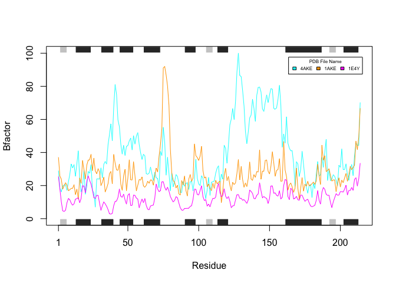

## *Given Code*


```r
# Can you improve this analysis code?
library(bio3d)
s1 <- read.pdb("4AKE") # kinase with drug
```

```
##   Note: Accessing on-line PDB file
```

```r
s2 <- read.pdb("1AKE") # kinase no drug
```

```
##   Note: Accessing on-line PDB file
##    PDB has ALT records, taking A only, rm.alt=TRUE
```

```r
s3 <- read.pdb("1E4Y") # kinase with drug
```

```
##   Note: Accessing on-line PDB file
```

```r
s1.chainA <- trim.pdb(s1, chain = "A", elety = "CA")
s2.chainA <- trim.pdb(s2, chain = "A", elety = "CA")
s3.chainA <- trim.pdb(s3, chain = "A", elety = "CA")

s1.b <- s1.chainA$atom$b
s2.b <- s2.chainA$atom$b
s3.b <- s3.chainA$atom$b

plotb3(s1.b, sse = s1.chainA, typ = "l", ylab = "Bfactor")
```

<!-- -->

```r
plotb3(s2.b, sse = s2.chainA, typ = "l", ylab = "Bfactor")
```

<!-- -->

```r
plotb3(s3.b, sse = s3.chainA, typ = "l", ylab = "Bfactor")
```

<!-- -->

# **Q6: How would you generalize the original code above to work with any set of input protein structures?**

## What lines of code get repeated for each?


s1 <- read.pdb("4AKE") 

s1.chainA <- trim.pdb(s1, chain = "A", elety = "CA")

s1.b <- s1.chainA$atom$b
s1.chainA$atom

plotb3(s1.b, sse = s1.chainA, typ = "l", ylab = "Bfactor")


## Now to turn this into a function...  


## This new function, **prot_drug_plot**, is used to visualize protein drug interactions from PDB data.

**prot_drug_plot** takes in a vector of PDB files as well as parameters to analyze each file (a chain, an element, and a factor, each as a string). The function iterates through the files vector, taking the first item and applying the parameters, then the second, and so on. It creates the first plot then adds any additional plots to the existing plot. 

The output is one plot (with residues on the x-axis and the specified factor on the y-axis) with a differently colored line for each file input.

*The list of colors could be changed/extended to accommodate more than three unique lines on the plot.* 


```r
prot_drug_plot <- function(file, chain, elmnt, fctr) {
  
  # allows our data to be different colors in the graph
  plot_colors <- c("cyan", "orange", "magenta")
  
  
  # to iterate through every value of the file vector
  for (i in 1:length(file)) {
  s1 <- read.pdb(file[i])

  s1.chain <- trim.pdb(s1, chain = chain, elety = elmnt)
  
  atom_df <- s1.chain$atom
  
  # the "$" syntax cannot take a variable, so s1.fctr takes in all the atom information and selects an entire column based on the factor input
  s1.fctr <- atom_df[, fctr] 
  
  # creates the first plot
  if (i == 1) {
    plotb3(s1.fctr, sse = s1.chain, typ = "l", ylab = paste(toupper(fctr), "factor", sep = ""), col = plot_colors[i])
    
    # adds additional plots to first plot
  } else {
    lines(s1.fctr, col = plot_colors[i])
  }
  }
  
  # creates a legend for the graph
  legend("topright", title = "PDB File Name", file, fill = plot_colors, horiz=TRUE, cex = 0.5, inset = c(0.03, 0.06))
}
```


## Test the function with three files and the parameters chain A, carbon, and factor b.

    

```r
files <- c("4AKE", "1AKE", "1E4Y")
chains <- "A"
elements <- "CA"
factors <- "b"

prot_drug_plot(files, chains, elements, factors)
```

```
##   Note: Accessing on-line PDB file
```

```
## Warning in get.pdb(file, path = tempdir(), verbose = FALSE): /var/folders/
## fr/kx9dm6l16qz51brxwd8t77b80000gn/T//RtmplpYYmu/4AKE.pdb exists. Skipping
## download
```

```
##   Note: Accessing on-line PDB file
```

```
## Warning in get.pdb(file, path = tempdir(), verbose = FALSE): /var/folders/
## fr/kx9dm6l16qz51brxwd8t77b80000gn/T//RtmplpYYmu/1AKE.pdb exists. Skipping
## download
```

```
##    PDB has ALT records, taking A only, rm.alt=TRUE
##   Note: Accessing on-line PDB file
```

```
## Warning in get.pdb(file, path = tempdir(), verbose = FALSE): /var/folders/
## fr/kx9dm6l16qz51brxwd8t77b80000gn/T//RtmplpYYmu/1E4Y.pdb exists. Skipping
## download
```

<!-- -->
    
